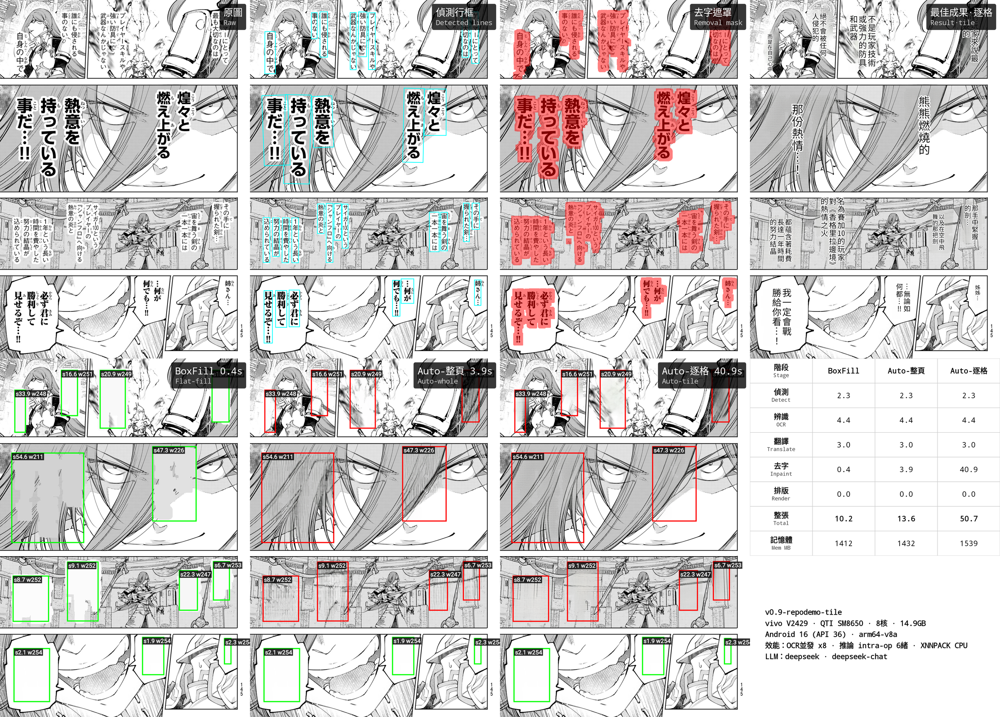

# Yakuyomi — 漫畫翻譯引擎

偵測、OCR、去字在裝置上跑（ONNX Runtime），翻譯走雲端 LLM。預設日文翻繁體中文，來源與目標語言都可改。

[English](README.md) ｜ 中文

狀態：整條 pipeline 在裝置上跑、驅動 Yakuyomi reader app——下載即翻、邊讀邊翻（即時翻譯）、換去字法免重翻的重繪都能用。第一版公開發佈準備中。

本 repo 是**引擎**（`yakuyomi-engine`）。reader app 就是 **Yakuyomi**——一個 [mihon](https://github.com/mihonapp/mihon) fork，用 submodule 引入這個引擎，見[儲存庫結構](#儲存庫結構)。

## 這是什麼

Yakuyomi 翻譯漫畫頁。五個階段裡四個在裝置上跑（ONNX Runtime + Canvas），只有翻譯連網：

```
頁 bitmap
  偵測  (ONNX)   文字行框 + 逐像素筆畫遮罩
  OCR   (ONNX)   每行一次前向  ->  原文
  分群           把對齊的行併成氣泡區塊
  翻譯  (LLM)    每頁一個請求、批次、限流
  去字  (ONNX)   抹掉原文（平塗或 LaMa）
  排版  (Canvas) 把譯文畫回去
  翻好的 bitmap
```

引擎只對外開一個呼叫，`translatePage(page): PageResult`（翻好／略過／失敗）。覆蓋原檔、「已翻譯」標記、續傳、背景翻譯佇列、邊讀邊翻是 reader app 的事。



來自 sandbox app：同一頁走過整條 pipeline——偵測、信賴門檻、去字、貼完譯文的成品——並比較三種去字模式（BoxFill、Auto-整頁、Auto-逐格）。表把每個模式各階段的用時與記憶體峰值拆開列出；橫幅記了裝置、生效的設定、跟 LLM。

## 目標

- **吞吐。** reader 不該卡在翻譯上。OCR 把一頁的文字行並發辨識、去字跟翻譯的網路等待重疊跑、下載 worker 在你讀到之前先翻好後面的頁。一頁在 Snapdragon 8 Gen 3 上大約 10–16 秒，視去字方法而定。三顆模型都跑在 CPU 上；該裝置上記憶體峰值約 1.4–1.5 GB——不需要 GPU，更遠不到 16 GB RAM。
- **可設定，能公開。** 服務商、模型、API base、金鑰、語言對都是設定（自備金鑰）。模型從你選的資料夾載入，不打包進 APK（自備模型）。約 20 個引擎參數可調，見 [docs/PARAMETERS_zh.md](docs/PARAMETERS_zh.md)。
- **絕不讓書庫變更糟。** 只有翻譯成功才覆蓋該頁。整頁沒文字、整頁翻譯失敗、或網路斷線，原圖原封不動。單一區塊翻譯失敗時保留它的日文，而不是清空。

## 能做什麼

- **偵測** — comic-text-detector。回傳文字行四邊形，加一張逐像素筆畫遮罩，用來把去字限制在筆畫上。
- **OCR** — 48px CTC 模型，每行一次前向、貪婪解碼。跑在 CPU 上（XNNPACK 會算錯這個模型）。文字行並發辨識，8 核手機上 OCR 大約砍半。
- **翻譯** — 雲端 LLM，沿用 manga-image-translator 的行號協定。任何 OpenAI 相容服務商都行；預設選單涵蓋 manga-image-translator 那組（OpenAI、DeepSeek、Gemini、Groq、Qwen、Sakura、自訂）外加 OpenRouter，各家的模型清單即時撈取。預設 DeepSeek。每頁請求在 semaphore 下並發以避開限流。某行翻譯失敗時退回原文，不會弄壞整頁。詳見 [docs/PROVIDERS.md](docs/PROVIDERS_zh.md)。
- **去字** — 三個模式，拿速度換品質。對話框一律平塗（乾淨、無黃暈），模式之間只差在壓在畫面上的字怎麼處理：

  | 模式 | 畫面上的字 | 速度 |
  |---|---|---|
  | BoxFill | 平塗（變色塊） | 最快 |
  | Auto-整頁（預設） | 整頁一次 LaMa | 平衡 |
  | Auto-逐格 | 逐區 LaMa | 最慢、最銳 |

- **排版** — 文字框排版，直排或橫排，字級自適應、垂直置中、描邊隨字級、行頭禁則、沿傾斜氣泡角度擺放。文字顏色依去字後的背景決定（亮底黑字、暗底白字）。
- **重繪（analyze | render 切分）** — 翻好的頁會連同它的分析素材一起回傳：文字遮罩，加上帶著原文與譯文的區塊。之後換去字法、重新排版時不必重跑偵測／OCR／LLM——換去字模式、升級品質只花去字 + 排版兩個階段，不耗 token。
- **語言** — 開箱即用日翻繁中。換目標語言、來源語言、few-shot 範例就能翻任何語言對。繁中輸出靠 prompt，沒有 OpenCC 後處理。

## 儲存庫結構

兩個 repo：

| Repo | 角色 |
|---|---|
| `yakuyomi-engine`（這個） | 引擎：`:engine`（整條 pipeline，只開 `translatePage`）、`:app-sandbox`（真機跑 pipeline 用）、`parity/` 桌面驗證工具。沒有 reader 程式碼。 |
| `Yakuyomi`（mihon fork） | reader app：mihon 加上下載 hook、翻譯設定、模型管理。用 git submodule + Gradle `includeBuild` 引入引擎。 |

引擎跟 reader 解耦，才能自己單獨測；app 是真正的 mihon fork。引擎的改動 commit 在這裡，app 端 bump submodule 指標。

## 模型

權重不 commit、也不打包進 APK。reader 可自動下載，或你手動放進指定的資料夾——出處、雜湊、授權見 [docs/MODELS_zh.md](docs/MODELS_zh.md)。

| 階段 | 模型 | 來源 |
|---|---|---|
| 偵測 | comic-text-detector | [dmMaze/comic-text-detector](https://github.com/dmMaze/comic-text-detector) |
| OCR | 48px CTC | 權重來自 [manga-image-translator](https://github.com/zyddnys/manga-image-translator)，在這裡轉成 ONNX |
| 去字 | LaMa（漫畫微調） | `lama-manga.onnx` 來自 [Koharu](https://github.com/mayocream/koharu)；架構為 [advimman/LaMa](https://github.com/advimman/lama) |
| 字型 | Noto Sans/Serif CJK、思源 | CJK 算繪（OFL / Apache） |

## 建置

引擎是標準的 Android Gradle library。要跑 pipeline 最快的方式是 sandbox app（`:app-sandbox`）：

```
./gradlew :app-sandbox:assembleDebug
```

裝起來，指向放三個 `.onnx` 模型的資料夾，選測試圖，跑診斷或去字比較。reader app（Yakuyomi）在另一個 fork repo。

## 設定

每個可調參數、值域、改了會怎樣，都寫在 [docs/PARAMETERS_zh.md](docs/PARAMETERS_zh.md)。reader 的翻譯設定開放同一組，按階段分組，進階旋鈕收在開關後面。

## 與 manga-image-translator 的關係

引擎是純 Kotlin + ONNX Runtime 從頭實作，不含 manga-image-translator 的原始碼。借的是行為——翻譯 prompt 與協定、參數預設、模型選擇與處理順序。細節與分層對齊原則在 [docs/ARCHITECTURE_zh.md](docs/ARCHITECTURE_zh.md)。

## 致謝

- [mihon](https://github.com/mihonapp/mihon) — app fork 的來源（Apache-2.0）
- [manga-image-translator](https://github.com/zyddnys/manga-image-translator) — prompt 與行為參考
- [Koharu](https://github.com/mayocream/koharu) — `lama-manga.onnx` 模型與 ONNX 匯出參考
- [comic-text-detector](https://github.com/dmMaze/comic-text-detector)、[LaMa](https://github.com/advimman/lama) — 模型與架構
- Noto Sans/Serif CJK、思源 — 字型

## 授權

**GPL-3.0** — 見 [LICENSE](LICENSE)。這裡的程式碼是用 Kotlin/ORT 從頭寫的，但移植了 manga-image-translator 的 prompt、參數與分組；作為該 GPL-3.0 專案的衍生，本引擎為 GPL-3.0。

各組件授權：
- [manga-image-translator](https://github.com/zyddnys/manga-image-translator) — GPL-3.0（prompt/協定、偵測/OCR/翻譯行為、文字行分組；48px CTC OCR 模型）
- [comic-text-detector](https://github.com/dmMaze/comic-text-detector) — GPL-3.0（文字偵測模型）
- [Koharu](https://github.com/mayocream/koharu) — GPL-3.0（`lama-manga.onnx` 去字模型）
- [LaMa](https://github.com/advimman/lama) — Apache-2.0（去字底層架構）
- [mihon](https://github.com/mihonapp/mihon) — Apache-2.0（reader fork 在另一個產品 repo；Apache-2.0 與 GPL-3.0 相容，故組合後的 app 為 GPL-3.0）

模型權重**不由本專案散布**——自備（見設定說明），從上述來源依各自授權取得。字型未 bundle（系統 CJK fallback）。
